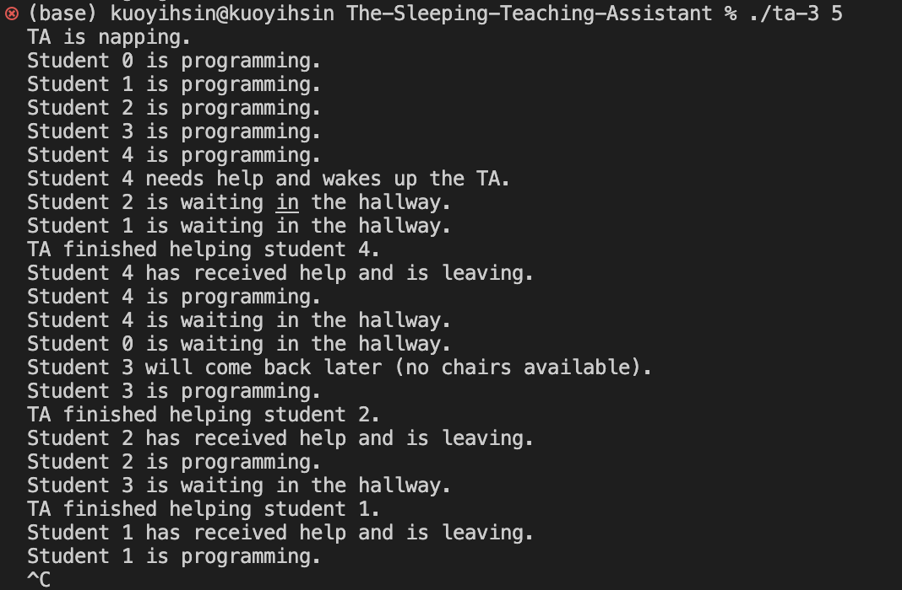

# The Sleeping Teaching Assistant

The Sleeping Teaching Assistant is a C++ program that simulates a university computer science department TA's office hours using POSIX threads, mutex locks, semaphores and conditional variables.

## Environment Setup
To set up the environment for this project, follow these steps:

1. Install a C++ compiler, such as G++, if you don't already have one. You can follow the installation guide for your operating system:
- [Linux (Ubuntu)](https://linuxconfig.org/how-to-install-g-the-c-compiler-on-ubuntu-18-04-bionic-beaver-linux)
- [macOS](https://www3.cs.stonybrook.edu/~alee/g++/g++_mac.html)
- [Windows](http://www.codebind.com/cprogramming/install-mingw-windows-10-gcc/)

## How to Run the Program
To run the program, follow these steps:

1. Open a terminal or command prompt.
2. Navigate to the directory where your ta_office.c source file is located.
3. Compile the source file using the following command: `g++ ta-3.cpp -o ta-3 -lpthread`
4. Execute the compiled program by entering ./ta_office <number_of_students> (or ta-3.exe <number_of_students> on Windows) in your terminal, replacing <number_of_students> with the desired number of students. For example: `./ta-3 5`
5. The program will run and display the interactions between the TA and the students.

## Runing result

## Code Explanation
The program uses POSIX threads, mutex locks, semaphores, and condition variables to manage the interactions between the TA and the students.

- The `main function` initializes the required threads, mutex locks, semaphores, and condition variables. It then creates a separate thread for the TA and each student.
- The `student_thread` function simulates student activities such as programming, seeking help from the TA, waiting in the hallway, or coming back later if no chairs are available. It uses a combination of mutex locks and condition variables to ensure that the student waits for help and is notified when the TA has finished helping them.
- The `ta_thread` function simulates the TA's activities, such as helping students, checking if students are waiting for help, or taking a nap if no students are present. It also uses mutex locks and condition variables to notify students when they are done helping them.
- Mutex locks are used to ensure that only one student can modify the waiting_students and waiting_students_queue variables at a time, preventing race conditions.
- Semaphores are used to manage the availability of chairs in the hallway and to wake up the TA when a student arrives.
- Condition variables are used to notify students when the TA has finished helping them, allowing them to resume their activities.

